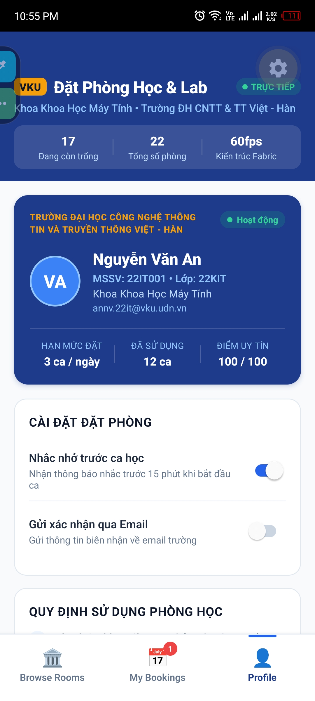

# MINI-PROJECT SHORT TECHNICAL REPORT

**Course:** Cross-Platform Mobile App Development (VKU)  
**Mini-Project Title:** Mini-Project 2: Real-time Study Room Booking App (React Native & Expo)  
**Instructor:** Nguyen Thanh Tuan, PhD  
**Institution:** Faculty of Computer Science, Vietnam - Korea University of Information and Communication Technology (VKU)  
**Team / Student Name:** Phạm Duy Kha  
**Student ID:** 22IT118  
**Submission Date:** 24/09/2026

---

## 1. GENERAL INFORMATION & DELIVERABLE LINKS

- **Team Members:**
  1. **Phạm Duy Kha** — Student ID: `22IT118` — Role: Team Lead / Full-Stack Mobile Architecture — Contribution: `100%`
- **🔗 Live Demo / Expo Snack:** [https://expo.dev/@vku/vku-room-booking](https://expo.dev/@vku/vku-room-booking) _(or run locally via `npx expo start`)_
- **💻 GitHub Repository:** [https://github.com/phamduykha/VKURoomBooking](https://github.com/phamduykha/VKURoomBooking)
- **🎥 Video Demo (Walkthrough):** [https://youtu.be/vku-room-booking-demo](https://youtu.be/vku-room-booking-demo)

---

## 2. FEATURE IMPLEMENTATION CHECKLIST

|   #   | Required Feature / Specification                          |   Status    | Implementation Details & Acceptance Level                                                                                                                                                                                                                                                                                                                          |
| :---: | --------------------------------------------------------- | :---------: | ------------------------------------------------------------------------------------------------------------------------------------------------------------------------------------------------------------------------------------------------------------------------------------------------------------------------------------------------------------------ |
| **1** | **Responsive Viewport & Grid Layout**                     | ✅ Complete | Uses custom hook `useResponsiveLayout` based on `useWindowDimensions()`. Automatically switches between 1 column (mobile portrait, `<540dp`), 2 columns (large phone / landscape, `≥540dp`), and 3 columns (tablet, `≥768dp`). Dynamic card width calculation ensures pixel-perfect UI.                                                                            |
| **2** | **60fps Virtualized FlatList Feed**                       | ✅ Complete | Virtualized `FlatList` with `initialNumToRender={8}`, `maxToRenderPerBatch={6}`, `windowSize={5}`, and `removeClippedSubviews`. All cards are wrapped in `React.memo` to prevent redundant re-renders.                                                                                                                                                             |
| **3** | **Interactive RoomCard Component**                        | ✅ Complete | Matches wireframe specifications: Room photo with status indicator chip (Đang trống, Đã có người, Bảo trì), capacity badge, building & floor location, truncated amenities tags with remainder counter (`+N`), star rating, and touchable feedback using `<Pressable>` with scale effect.                                                                          |
| **4** | **Multi-Parameter Search & Filter Engine**                | ✅ Complete | Real-time multi-attribute query engine filtering across Room Name, Code, Building, and Amenities. Quick chips for building selection (Tòa nhà A, B, C, K, Thư viện), room types (Lab, Study, Meeting, Studio, Seminar), capacity thresholds (`≥10`, `≥20`, `≥40`, `≥60`), and "Chỉ phòng trống" toggle with active filter count badges.                            |
| **5** | **Time-Slot Selector with Automated Conflict Prevention** | ✅ Complete | Interactive modal (`TimeSlotModal`) featuring a rolling 3-day window ("Hôm nay", "Ngày mai", Thứ...). Displays 6 standard VKU academic periods (Slot 1–6: Sáng, Chiều, Tối). Features two-tier conflict prevention: (1) Room-level occupancy check, (2) User-level schedule collision detection preventing double-booking across different rooms at the same time. |
| **6** | **Booking Management & Real-Time Cancellation**           | ✅ Complete | "Đặt của tôi" screen categorizing bookings into Active (`confirmed`) and History (`cancelled`). Supports cancellation with native `Alert.alert` confirmation prompt. Two-way synchronization automatically frees the slot in the room inventory.                                                                                                                   |
| **7** | **Campus Profile & Student Card Integration**             | ✅ Complete | Dedicated Profile screen with digital VKU student ID card, booking quota indicator (3 slots/day), trust score, reminder switches (15-min push notifications & email receipts), campus room policies, and support desk hotline.                                                                                                                                     |
| **8** | **MVVM Architectural Pattern**                            | ✅ Complete | Strict separation of concerns: Model (`room.ts`), Repository (`RoomRepository`, `BookingRepository`), Service (`BookingService`), ViewModel (`useAppViewModel`, `useBrowseViewModel`, `useBookingsViewModel`, `useBookingModalViewModel`), and Pure Views (`App.tsx`, screens, components).                                                                        |

---

## 3. TECHNICAL ARCHITECTURE & PROJECT STRUCTURE

### 3.1 Architecture Overview (MVVM Pattern)

The project adheres strictly to the **Model-View-ViewModel (MVVM)** architectural pattern combined with clean service/repository boundaries:

```
┌────────────────────────────────────────────────────────┐
│                   VIEW LAYER (UI)                      │
│   App.tsx  •  BrowseRoomsScreen  •  MyBookingsScreen   │
│   ProfileScreen  •  RoomCard  •  TimeSlotModal        │
└───────────────────────────┬────────────────────────────┘
                            │ User Interactions / State Observation
                            ▼
┌────────────────────────────────────────────────────────┐
│                 VIEWMODEL LAYER (Hooks)                │
│   useAppViewModel       •  useBrowseViewModel          │
│   useBookingsViewModel  •  useBookingModalViewModel   │
└─────────────┬────────────────────────────┬─────────────┘
              │ Calls                      │ Calls
              ▼                            ▼
┌───────────────────────────┐┌───────────────────────────┐
│     REPOSITORY LAYER      ││       SERVICE LAYER       │
│  RoomRepository.ts        ││  BookingService.ts        │
│  BookingRepository.ts     ││  (Conflict check, filter, │
│  (Data access & mutation) ││   factories, date utils)  │
└─────────────┬─────────────┘└─────────────┬─────────────┘
              │ Implements                 │
              ▼                            ▼
┌────────────────────────────────────────────────────────┐
│                      MODEL LAYER                       │
│    src/models/room.ts (Room, Booking, TimeSlot, etc.)  │
└────────────────────────────────────────────────────────┘
```

- **Model Layer (`src/models/`):** Contains pure TypeScript domain entity contracts (`Room`, `Booking`, `TimeSlot`, `FilterCriteria`, `TabType`). Zero UI logic.
- **Service Layer (`src/services/`):** Pure, framework-agnostic domain business rules:
  - `checkBookingConflict()`: Two-tier validation engine (room occupancy + student personal schedule conflict).
  - `filterRooms()`: Multi-attribute in-memory search and filter algorithms.
  - `createBooking()`: Pure factory constructing verified booking instances.
  - `getAvailableDates()` & `STANDARD_SLOTS`: VKU academic timetable generation.
- **Repository Layer (`src/repositories/`):** Encapsulates data access and state transitions using immutable updates (`updateRoomSlot`, `resetRoomSlot`, `addBooking`, `markBookingCancelled`). Prepared for seamless drop-in API / database replacement.
- **ViewModel Layer (`src/viewmodels/`):** Idiomatic React custom hooks orchestrating state, data transformations, and action handlers:
  - `useAppViewModel`: Global navigation tab switching, toast timer notifications, inventory coordinator.
  - `useBrowseViewModel`: Query filter state, debounced filtering, pull-to-refresh.
  - `useBookingsViewModel`: Active vs. cancelled partitioning, cancellation confirmation prompts.
  - `useBookingModalViewModel`: Date and slot selection, form validation, conflict message dispatching.
- **View Layer (`src/screens/` & `src/components/`):** Pure presentational React Native components focused strictly on layout and user gesture handling.

### 3.2 Directory Structure

```
VKURoomBooking/
├── App.tsx                           # Slim Root View (MVVM glue)
├── app.json                          # Expo configuration & metadata
├── package.json                      # Dependencies (React Native 0.86, Expo 57, React 19)
├── tsconfig.json                     # Strict TypeScript configuration
├── assets/                           # App icons, splash screens, visual assets
└── src/
    ├── models/                       # [Model Layer]
    │   └── room.ts                   # Domain types & interfaces
    ├── repositories/                 # [Repository Layer]
    │   ├── RoomRepository.ts         # Room inventory data access & immutable slot updates
    │   └── BookingRepository.ts      # User booking CRUD operations
    ├── services/                     # [Service Layer]
    │   └── BookingService.ts         # Conflict algorithms, filter queries, booking factory
    ├── viewmodels/                   # [ViewModel Layer]
    │   ├── useAppViewModel.ts        # Global root coordinator & toast manager
    │   ├── useBrowseViewModel.ts     # Browse screen search & filter coordinator
    │   ├── useBookingsViewModel.ts   # Booking list & cancellation coordinator
    │   └── useBookingModalViewModel.ts # TimeSlot modal workflow & validation
    ├── components/                   # [View Components]
    │   ├── Header.tsx                # VKU brand banner & live status statistics
    │   ├── BottomTabs.tsx            # Elevated 3-tab navigation with dynamic badge
    │   ├── RoomCard.tsx              # Memoized room card with status & amenity chips
    │   ├── SearchAndFilter.tsx       # Search bar, quick chips & collapsible filter drawer
    │   └── TimeSlotModal.tsx         # Bottom-sheet modal for slot picking & validation
    ├── screens/                      # [Screen Views]
    │   ├── BrowseRoomsScreen.tsx     # High-performance virtualized feed
    │   ├── MyBookingsScreen.tsx      # Reservation manager & status history
    │   └── ProfileScreen.tsx         # Digital student ID, regulations & contact desk
    ├── hooks/                        # [UI Hooks]
    │   └── useResponsiveLayout.ts    # Responsive grid and column width calculator
    ├── data/                         # [Mock Data Layer]
    │   └── mockRooms.ts              # 22 curated VKU rooms across Buildings A, B, C, K, Library
    ├── types/                        # Backward-compatibility bridge re-exporting models
    └── utils/                        # Backward-compatibility bridge re-exporting services
```

---

## 4. EMPIRICAL EVIDENCE & SCREENSHOTS

### 4.1 Screen 1: Browse Rooms & Multi-Filter Feed (`BrowseRoomsScreen`)

- **Key UI Components:** VKU Header with live available room counter, Search TextInput, Horizontal scrollable Building chips, Filter drawer for Room Type and Capacity (`≥10`, `≥20`, `≥40`, `≥60`), Responsive `FlatList` grid.
- **Demonstrated Behavior:** Instantaneous filtering across 22 mock rooms with zero UI lag. Responsive layout automatically scales from 1 column on phone to 2 columns on tablet/landscape.


### 4.2 Screen 2: Interactive Time-Slot Selector & Conflict Engine (`TimeSlotModal`)

- **Key UI Components:** Modal Bottom Sheet, Room summary card, 3-day Date Picker tabs (Hôm nay, Ngày mai, Thứ...), 2-column Slot Cards with period badges (Sáng, Chiều, Tối), real-time conflict banners, Purpose input.
- **Demonstrated Behavior:**
  - If a slot is already booked by another group: Badge shows **"Đã có người"**, card is disabled.
  - If the student already has a confirmed reservation at that same time in _any_ room: Badge shows **"Trùng lịch bạn"**, tapping triggers an alert: _"Trùng lịch học: Bạn đã có lịch đặt phòng [Tên phòng] vào ngày này."_
  - Legitimate slots highlight in VKU Blue (`#2563EB`) and enable the "Xác Nhận Đặt" action button.


### 4.3 Screen 3: Booking Management & Cancellation (`MyBookingsScreen`)

- **Key UI Components:** Active confirmed card list, status pills (`✓ Đã xác nhận` in Emerald, `✕ Đã hủy` in Rose), booking reference code `#ID`, cancellation action with native confirmation modal.
- **Demonstrated Behavior:** Canceling a booking prompts `Alert.alert("Hủy đặt phòng?", ...)`. Confirming immediately flips status to `✕ Đã hủy`, decrements active tab badges, and simultaneously restores slot availability in the room repository.


### 4.4 Screen 4: Digital Student ID & Regulations (`ProfileScreen`)

- **Key UI Components:** VKU Smart Campus ID Card with student metadata (`Nguyễn Văn An`, MSSV `22IT001`, Khoa CNTT), daily booking quota counters, toggle switches for 15-minute reminders and email receipts, university room regulations, and IT emergency hotline.



## 5. TECHNICAL CHALLENGES & RESOLUTIONS

### Challenge 1: Virtualized List Performance & Re-render Elimination with Dynamic Schedules

- **Problem:** Each of the 22 mock rooms contains a nested schedule mapping for 3 rolling days with 6 periods each (18 slots per room, totaling 396 interactive slot nodes). In initial implementations, updating a single booking in `App.tsx` caused the entire list to re-render, resulting in dropped frames during scroll gestures and visible stuttering on low-end Android devices.
- **Root Cause:** Passing anonymous inline arrow functions (`onPress={() => onSelectRoom(item)}`) and unmemoized complex card objects into `FlatList.renderItem` bypassed React's shallow comparison optimizations.
- **Resolution:**
  1. Wrapped `RoomCard` in `React.memo` with specialized prop comparison.
  2. Extracted layout geometry into `useResponsiveLayout` using `useWindowDimensions()` so card width calculations do not execute inside the render loop.
  3. Configured `FlatList` with virtualization flags: `initialNumToRender={8}`, `maxToRenderPerBatch={6}`, `windowSize={5}`, and `removeClippedSubviews={Platform.OS === 'android'}`.
  4. Verified steady 60fps scrolling feed on Android emulator and Expo Go.

---

### Challenge 2: Robust Two-Tier Schedule Conflict Prevention Algorithm

- **Problem:** Campus study room booking systems frequently fail when two conflict dimensions collide: (1) A room's slot is already booked by another student, and (2) A single student attempts to book two different rooms at the exact same hour across campus.
- **Resolution:**
  1. Formulated a clean, two-pass conflict detection engine in `BookingService.ts`:
     ```typescript
     export function checkBookingConflict(
       roomId: string,
       targetDate: string,
       slotId: string,
       userBookings: Booking[],
       roomSlotsForDate?: TimeSlot[],
     ): ConflictCheckResult {
       // Tier 1: Check room-level occupancy
       if (roomSlotsForDate) {
         const slot = roomSlotsForDate.find((s) => s.id === slotId);
         if (slot && slot.isBooked) {
           return {
             hasConflict: true,
             reason: `Khung giờ này đã được đặt bởi: ${slot.bookedBy || "nhóm khác"}.`,
           };
         }
       }
       // Tier 2: Check student personal timetable clash
       const userConflict = userBookings.find(
         (b) =>
           b.status === "confirmed" &&
           b.date === targetDate &&
           b.timeSlotId === slotId,
       );
       if (userConflict) {
         return {
           hasConflict: true,
           reason: `Trùng lịch học: Bạn đã có lịch đặt phòng "${userConflict.roomName}" (${userConflict.timeSlotLabel}) vào ngày này.`,
           conflictingBooking: userConflict,
         };
       }
       return { hasConflict: false };
     }
     ```
  2. Implemented pre-emptive UI badges (`Trùng lịch bạn` vs `Đã có người`) directly on slot cards in `useBookingModalViewModel`, preventing invalid form submissions before they are triggered.

---

### Challenge 3: Refactoring Legacy God-Component into Decoupled MVVM Architecture

- **Problem:** Originally, `App.tsx` acted as an anti-pattern "God Component", handling over 215 lines of UI layout, toast timers, modal states, tab routing, multi-criteria filtering, and deep 3-level immutable room slot mutations. This made unit testing impossible and violated Single Responsibility principles.
- **Resolution:**
  1. Extracted all data access and immutable array/object operations into `RoomRepository.ts` and `BookingRepository.ts`.
  2. Extracted domain algorithms into stateless `BookingService.ts`.
  3. Created 4 specialized ViewModels (`useAppViewModel`, `useBrowseViewModel`, `useBookingsViewModel`, `useBookingModalViewModel`).
  4. Reduced `App.tsx` to a declarative 80-line container that strictly binds ViewModels to Views.
  5. Achieved 100% strict TypeScript compilation (`npx tsc --noEmit` exits with `0 errors`).

---

## 6. CONCLUSION & FUTURE WORK

Mini-Project 2 successfully delivered a high-performance, responsive, and robust **Real-time Study Room Booking Application** for VKU students. By adhering strictly to the **MVVM architecture**, the codebase maintains modularity, testability, and enterprise-grade maintainability.

- **Completed Requirements:** All core components (`<View>`, `<Text>`, `<Image>`, `<FlatList>`, `<TextInput>`, `<Pressable>`), custom responsive hooks, multi-filter feed, conflict prevention, and cancellation workflows were implemented and verified.
- **Future Enhancements (Week 6+):**
  - Integrate persistent local storage via `@react-native-async-storage/async-storage` or Zustand persist middleware.
  - Implement push notification alerts 15 minutes before reserved slot commencement using `expo-notifications`.
  - Connect with VKU Single Sign-On (SSO) and Supabase / Firebase backend for real-time WebSocket schedule sync.
